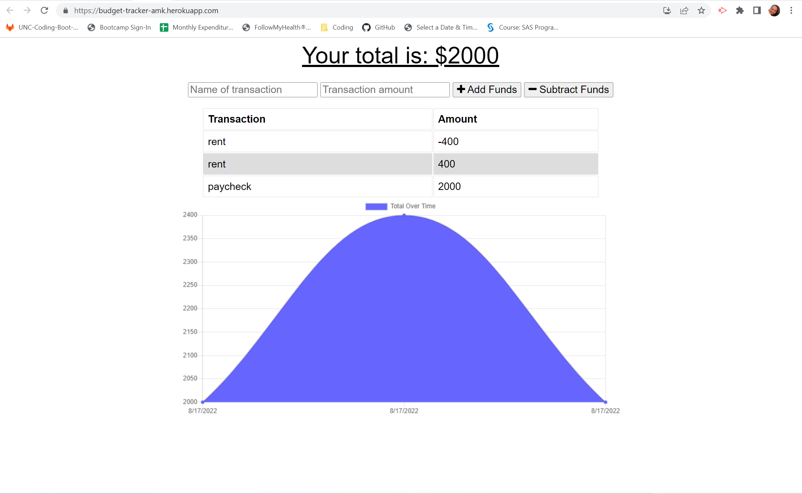
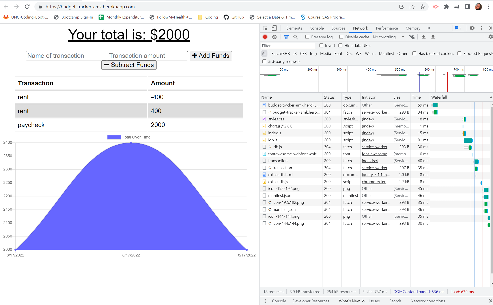
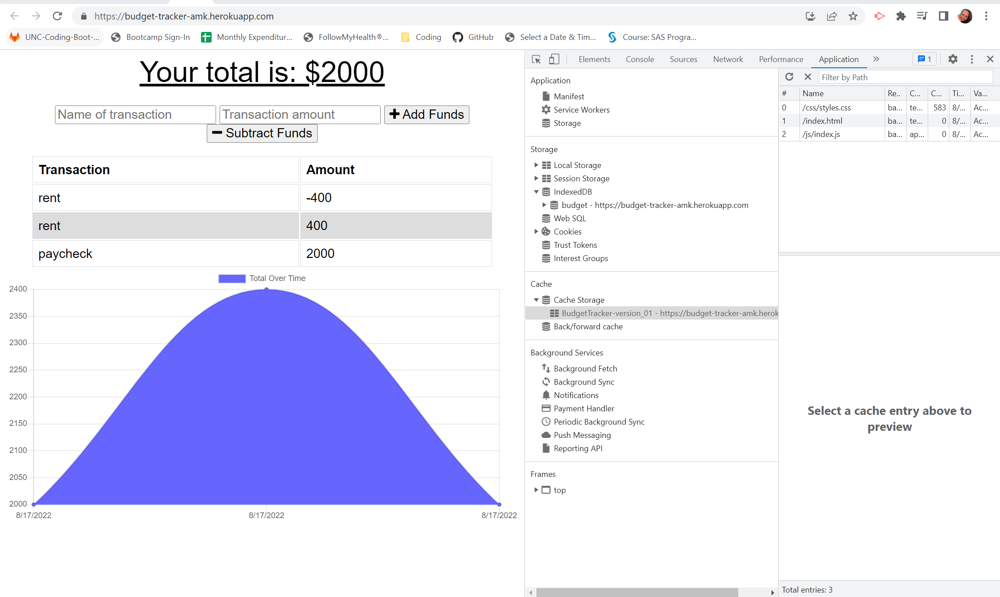

# Budget-Tracker


## Description
An application that allows a user the ability to track their withdrawals and deposits with or without a data/internet connection so that their account balance is accurate when they are traveling. The requirements were as follows:

* When the user inputs an expense or deposit, they will receive a notification that they have added an expense or deposit.
* When the user reestablishes an internet connection, the deposits or expenses added while they were offline are added to their transaction history and their totals are updated.

## Table of Contents
- [Installation](#installation)
- [Links](#links)
- [Usage](#usage)
- [License](#license)
- [How to Contribute](#how-to-contribute)
- [Questions](#questions)

## Installation
Visit the GitHub repository, Budget-Tracker (see the link below), to fork and clone the repository. The JSON file will have the necessary dependencies. Use
````````````
npm install
````````````
to install the dependencies locally.

## Links
- [GitHub Repo](https://github.com/amklenk/AK-Budget-Tracker)
- [Heroku Deployed App](https://budget-tracker-amk.herokuapp.com/)

## Usage
The following are screenshots of the deployed application:

Application With Data:


Application With Dev Tools (Network):


Application With Dev Tools (Application/Cache):


The models directory contains the schema for transactions. The routes directory contains the API routes that access the Mongoose methods. The public route contains the css directory with styles.css, the icons directory with different sizes of the Budget Tracker icon, the images directory with the README images, and the js directory with the idb.js (IndexedDB) and index.js (front-end JS) files. It also contains the index.html, manifest.json, and service-worker.js files. The app is run through opening server.js in an integrated terminal and by typing
`````````
npm start
`````````
into the command line (to turn on the server at localhost:3001). The deployed application can be accessed via the Heroku link (see links).

## License
The badge at the top of the page shows that this project is licensed under MIT. The link for that license is shown below.
- [License: MIT](https://opensource.org/licenses/MIT)

## How to Contribute
Please fork and clone the repository and use a pull request to add or make changes to the current repository.

## Questions
Please direct any questions to amandamklenk3@gmail.com. To see more projects, visit the link below for amklenk's respository:
- [Amanda Klenk's GitHub Repository](https://github.com/amklenk)


